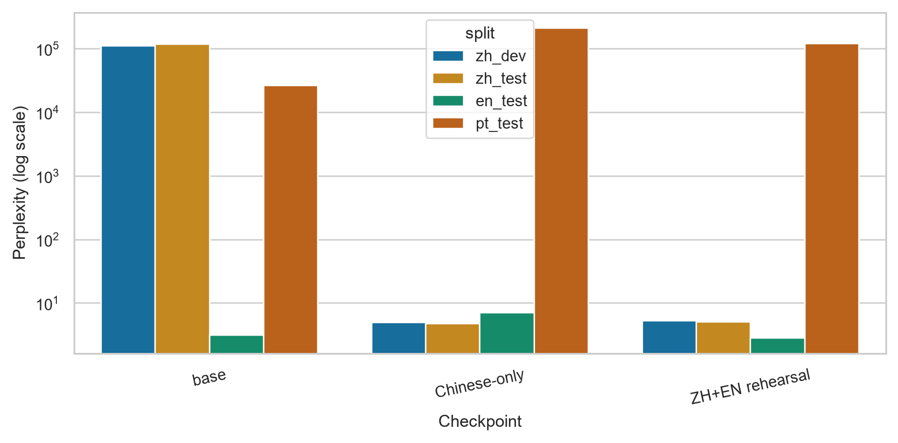
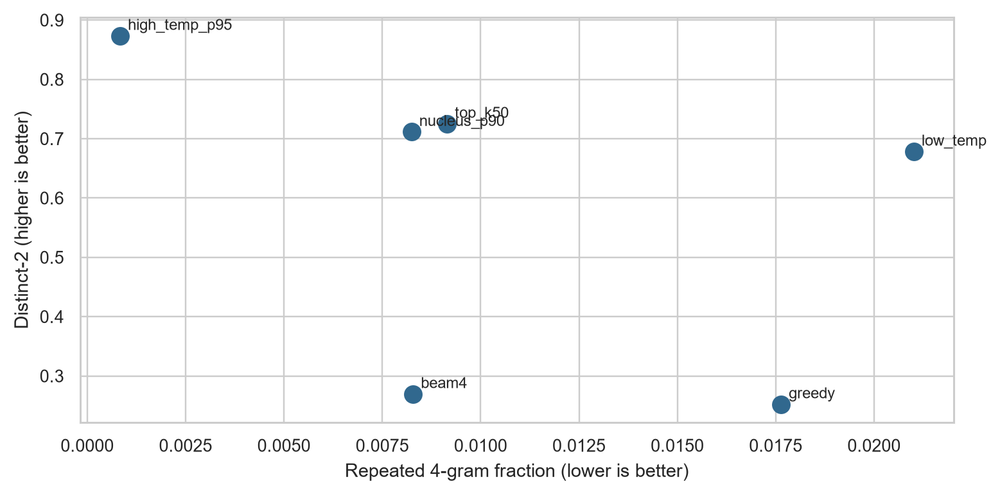
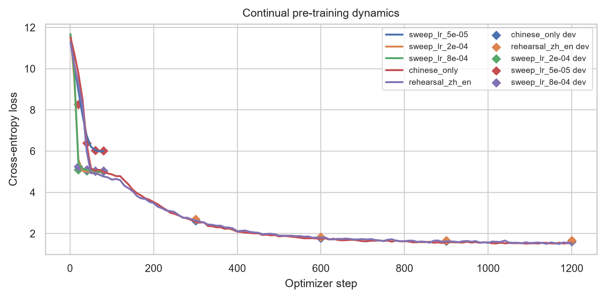

# Multilingual Continual Pretraining

I study how a small English story model acquires Chinese and how much of its
English generation ability survives that adaptation. The experiment uses a
41.69M-parameter Llama-style checkpoint, Chinese-only training, and a Chinese
plus English rehearsal condition. Portuguese is an additional evaluation
language.

[中文说明](README.zh-CN.md) · [Results notebook](notebooks/results_review.ipynb) ·
[Full report](report/report.pdf) · [Recorded measurements](results/recorded/)

## Results

The main metric is token-weighted perplexity on the same 128 packed blocks per
language: 32,640 predicted tokens. Lower is better.

| Checkpoint | Chinese PPL | English PPL | Portuguese PPL |
| --- | ---: | ---: | ---: |
| Base | 117,885.17 | 3.14 | 26,522.53 |
| Chinese-only | 4.80 | 7.07 | 214,567.28 |
| Chinese + English rehearsal | 5.05 | 2.86 | 121,860.09 |

Chinese-only adaptation substantially improves Chinese perplexity while
English and Portuguese become worse. Mixing 1,000 English stories with the
10,000 Chinese training stories preserves much more English performance under
the same 1,200-update budget. Portuguese remains poorly modeled in both adapted
conditions.



The English decoding study contains 72 continuations: four prompt types, six
decoding settings, and three seeds. Sampling raises lexical diversity; several
high-temperature samples have weaker narrative coherence. None of the outputs
emits EOS within the 128-token budget. Generated samples and their summary
statistics are included with the results.



## Experiment design

- The tokenizer stays fixed at 32K vocabulary items. Stories are separated by
  EOS and packed into 256-token blocks.
- Three learning rates receive 80 updates each. Chinese development perplexity
  selects `2e-4` for both final conditions.
- AdamW uses batch size 8, two gradient accumulation steps, 6% warm-up, cosine
  decay, weight decay 0.1, and gradient clipping at 1.0. The seed is 7021.
- A second evaluation averages per-document perplexity with a 512-token cap.
  Those values are reported separately in `course_compute_ppl.csv`.



## Run the project

The recorded environment used Python 3.12 and a CUDA-enabled PyTorch build on
an RTX 4060. `requirements.txt` records its package versions.

```bash
python -m pip install -r requirements.txt --extra-index-url https://download.pytorch.org/whl/cu128
```

The original checkpoint and story files were supplied for a graduate NLP
course project. Acquire those assets separately, then place the Hugging Face
checkpoint directory under `models/base/` and the seven story files under
`data/course/`. [Input documentation](data/README.md) lists the filenames and
replay requirements. `CPT_MODEL_PATH` can point to another checkpoint location.

```bash
python src/prepare_data.py --rehearsal-file /path/to/en_rehearsal.jsonl
python src/run_experiments.py
python src/course_ppl.py
```

New measurements and checkpoints are written under `runs/`. To redraw the
recorded figures without loading a checkpoint:

```bash
CPT_RESULTS_DIR=results/recorded python src/render_results.py
```

To check the numerical exports without a GPU or ML packages:

```bash
python scripts/verify_recorded_results.py
```

## Files

| Path | Contents |
| --- | --- |
| `src/` | Data preparation, generation, packed-token training, and both PPL protocols |
| `notebooks/results_review.ipynb` | Lightweight review of the saved measurements |
| `results/recorded/` | Tables, generated continuations, training logs, and input hashes |
| `figures/` | PNG and PDF versions of the experiment figures |
| `report/` | Project report and its LaTeX source |

## Interpretation

This study uses one small checkpoint, one seed, and a story domain. Token-weighted
and document-mean PPL weight examples differently: rehearsal beats the base on
fixed-token English PPL, but its document-mean English PPL remains above the
base. Diversity statistics describe lexical variation; the report also inspects
coherence errors in the generated text.

The historical input hashes identify the exact recorded assets. A replacement
checkpoint, corpus, or freshly sampled rehearsal set constitutes a new run.

## Sources

- [TinyStories](https://arxiv.org/abs/2305.07759)
- [llama2.c small-model training](https://github.com/karpathy/llama2.c)
- [Multilingual TinyStories](https://huggingface.co/datasets/Gabrui/multilingual_TinyStories)
- [Complete bibliography](report/references.bib)

This repository is a portfolio edition of coursework. Model weights, source
story datasets, and assignment handouts are acquired from their original
providers; third-party material retains its original terms.
